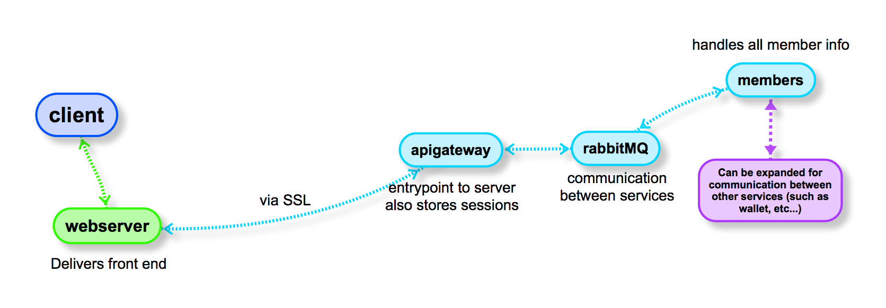

# shiro
Provides initial code for a project that allows user/registration/forgotpass/confirmpin flow.

## Features: 
**Front end**
- Aurelia (Typescript)
- i18n multilanguage
- bootstrap layout (desktop|tablets|mobile)

**Back end**
- Java
- Apache shiro for session management
- RabbitMQ for services communication
- Jetty for api endpoints
- Docker for launching containers



## Run/test
Runs with Docker containers
- ```sh ./build.sh```
- point browser to: **https://localhost:9443/**

there are prefilled users for testing: **0@a.com  with password: 123123**


### TODO and Security considerations
- Currently there's sensitive data stored as env variables in docker, this was just an experiment, an encrypted properties file would be prefered, or an external api point from where to grab the sensitive info
- RabbitMQ should use SSL for it's messages as well.
- Implement and event store for persisting data (database)